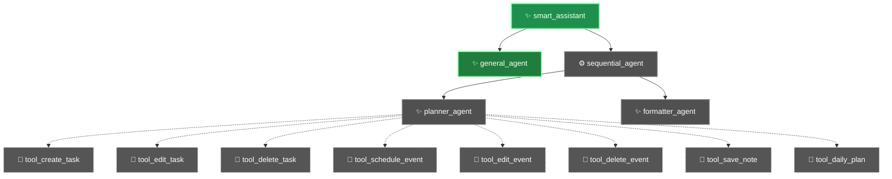

# Smart Assistant

A modular conversational assistant built with the Google ADK that routes user messages to specialized agents (router → general chat or planner pipeline) and performs deterministic scheduling, task and note operations persisted to Firestore. Implemented in Python 3.11, it uses the Google ADK (LLM agent abstractions), Google Cloud Firestore for persistence, and is packaged for containerized deployment with Docker.

---

## Overview

Smart Assistant provides an agent-based architecture that cleanly separates routing, intent planning, tool execution, and user-facing formatting. Its primary purpose is to let an LLM-based planner safely and deterministically perform schedule and task management operations (create/edit/delete tasks and events, save notes, and return a daily plan) while ensuring the user-facing responses are produced by a formatter agent that only converts structured results into natural language. This separation reduces the chance of the LLM inventing persistent state or tool outcomes.

The project is designed for production-like use: persistence is implemented via Firestore with a clearly defined document schema, tools are pure Python functions with deterministic behavior, and the planner enforces a strict JSON output contract so the formatter can reliably render final responses. The architecture emphasizes safety (only one agent calls tools), predictability (tools write results to an explicit shared state key), and operational readiness (Dockerfile and ADK CLI integration for running as a service).

Decisions that make this implementation different and production-oriented include: a router agent that delegates based on intent rather than making replies; a planner that returns structured JSON rather than freeform prose; deterministic tool functions that encapsulate Firestore access and conflict detection; and explicit normalization and urgency detection utilities so scheduling decisions are consistent. These choices reduce ambiguity, make automated testing easier, and make integrations (e.g., logging, monitoring, or additional orchestrators) straightforward.

---

## Features

- Agent Router — Classifies incoming messages and delegates to either the general conversational agent (no tools) or the sequential planner pipeline for operations that touch persistent user data.
- Planner Agent — Maps user intent to deterministic tool calls and returns structured JSON that describes the outcome (status, tool used, and data). Enforces rules for missing information, conflict handling, and output formatting.
- Formatter Agent — Converts Planner JSON into concise, user-facing natural language responses; never calls tools.
- Deterministic Tools — Pure Python tool functions (task/event/note CRUD and daily plan) that perform Firestore operations and write results to shared session state for the Formatter to consume.
- Firestore-backed Persistence — Thin Firestore wrapper that stores per-user tasks, events, and notes under a users collection and documents keyed by user_id.
- Time Normalization — Utility that converts natural time expressions (e.g., "7pm", "morning") into canonical "H:MM AM/PM" strings.
- Urgency Detection — Heuristics to detect high/medium/low urgency from free-text to support time assignment when the user delegates time selection.
- Conflict Detection — Tools check existing scheduled times and return structured "conflict" responses rather than making conflicting writes.
- Sequential Execution Pipeline — Planner and Formatter are run in sequence by a SequentialAgent so the Formatter reads the tool result from a defined state key.
- ADK Integration & Runtime Support — Designed to run under the Google ADK (adk web / adk run) and compatible with FastAPI via the Runner if integrated.
- Docker Support — Dockerfile provided to build a container that runs the ADK web command.

---

## Architecture

High-level design:
- The architecture follows an agent pipeline model implemented with the Google ADK agent primitives. The runtime entry point is the root LlmAgent (named `root_agent`) that acts purely as a Router.
- There are three primary runtime agent behaviors:
  - Router (root_agent): classifies messages and delegates.
  - General Agent: handles casual conversation and knowledge questions with no tool access.
  - Sequential Agent (planner → formatter): planner calls tools and writes structured results; formatter converts those results into final replies.

Components and responsibilities:
- Router receives every user message and applies deterministic rules (instructions) to select the correct sub-agent. It never replies directly.
- Planner processes messages that require data access; it uses intent extraction and maps intent to deterministic tools (create/edit/delete tasks/events, save notes, daily_plan).
- Formatter takes the JSON output from the planner and produces the final natural-language answer.
- Tools are pure Python functions that act as the only codepath that modifies persistent state (via db.py).
- db.py is the thin persistence layer that reads/writes Firestore documents and provides ID generation and conflict detection helpers.
- utils.py contains helper logic for time normalization, urgency detection, and a small keyword-based plan generator used by the planner.

Request lifecycle (conceptual):
1. Incoming text arrives at the runtime (adk web / adk run entrypoint).
2. Router classifies intent against rules in instructions.py.
3. If conversational, Router routes to general_agent which directly returns a natural-language reply.
4. If data-related, Router routes to sequential_agent which runs planner_agent first:
   - Planner extracts intent, checks required parameters, and decides on tool invocation.
   - Planner calls exactly one tool function (tools.py). Tool performs deterministic db operations and writes the result to tool_context.state["last_result"].
5. SequentialAgent runs formatter_agent next; formatter reads state["last_result"] and emits the final user-facing message.



Data movement and orchestration:
- Persistent state is stored in Firestore under collection `users` and document per user_id (tools use a hardcoded USER_ID="default_user" by default).
- Tool execution is synchronous and single-turn; no background workers or message queues are present in the repository.
- The router and agents are configured in code (smart_assistant/agent.py) and exposed via the ADK runtime.

---

## Component Descriptions

- agent.py
  - Purpose: Wire all agents and expose the runtime entrypoint `root_agent`.
  - Responsibilities: Instantiate LlmAgent and SequentialAgent objects and assign instructions and available tools.
  - Inputs: User messages delivered by the ADK runtime.
  - Outputs: Delegated agent runs and, for sequential flows, a formatted response produced by the formatter agent.
  - Interactions: Imports instruction prompts from instructions.py and tools list from tools.py.

- instructions.py
  - Purpose: Contains the system prompt strings for Router, General, Planner, and Formatter agents.
  - Responsibilities: Define deterministic routing rules, planner output contract (JSON), formatting rules, and example behaviors.
  - Inputs: None at runtime; these strings are passed to LLM agent constructors.
  - Outputs: Guidance that shapes agent behavior (used by `agent.py`).

- tools.py
  - Purpose: Deterministic tool implementations that the Planner calls to perform data operations.
  - Responsibilities: Implement create/edit/delete tasks and events, save notes, provide daily_plan, perform conflict checks and normalization via utils.py, write results into tool_context.state["last_result"].
  - Inputs: ToolContext (from ADK), and typed parameters (title, time, ids, etc.).
  - Outputs: Structured dicts describing status ("success", "conflict", "error") and resulting entities.

- db.py
  - Purpose: Thin Firestore wrapper that persists and retrieves tasks, events, and notes.
  - Responsibilities: Provide CRUD operations (add/edit/delete/get) for tasks/events/notes, id generation, timestamping, and conflict lookup.
  - Inputs: user_id and entity fields.
  - Outputs: Entities saved to or retrieved from Firestore; raises RuntimeError if required environment configuration is missing at init.
  - Interaction: Used exclusively by tools.py for state persistence.

- utils.py
  - Purpose: Pure utility functions for time parsing/normalization, urgency detection, and a small keyword-based plan generator.
  - Responsibilities: Normalize time expressions to canonical format, infer urgency levels, and map prompts to action tokens the Planner may use to choose tools.
  - Inputs: Free-text strings.
  - Outputs: Normalized times, urgency labels, and lists of action tokens.

- Dockerfile
  - Purpose: Containerize the application and run the ADK web server.
  - Responsibilities: install Python dependencies, copy repository, and run `adk web` on container start.

- requirements.txt
  - Purpose: Pin runtime dependencies required by the project (Google ADK, Firestore client, FastAPI/uvicorn, python-dotenv, etc.).

---

## Tech Stack

Component | Technology | Purpose
--- | --- | ---
Language | Python 3.11 (Dockerfile base) | Implementation language and runtime
Agent Framework | google-adk | Agent primitives (LlmAgent, SequentialAgent), runtime (`adk web`)
LLM Integration | google-genai | Model client integration (referenced in requirements and expected by ADK runtime)
Persistence | google-cloud-firestore | Firestore client used for storing tasks/events/notes
Configuration | python-dotenv | Load .env into process environment
Web runner | FastAPI, uvicorn | Included in requirements; ADK can expose via FastAPI Runner if used
Containerization | Docker | Container image (Dockerfile provided)
Utilities | pydantic (available), google-cloud-logging | Used for runtime operations and logging infrastructure

---

## Project Structure

Repository top-level:
```
.
├── .dockerignore
├── .gitignore
├── Dockerfile
├── README.md
├── requirements.txt
└── smart_assistant/
    ├── __init__.py
    ├── agent.py
    ├── instructions.py
    ├── tools.py
    ├── db.py
    └── utils.py
```

Responsibilities:
- .dockerignore — files to exclude from Docker context (project-defined).
- .gitignore — typical Python/Docker ignores.
- Dockerfile — builds a container image and runs the ADK web server: CMD ["adk", "web", "--host", "0.0.0.0", "--port", "8080"].
- requirements.txt — runtime dependencies required to run the project.
- smart_assistant/__init__.py — package initializer; exposes the agent module.
- smart_assistant/agent.py — wires and exports the `root_agent` entrypoint expected by ADK.
- smart_assistant/instructions.py — system prompts for router, general, planner, and formatter agents; includes planner → tool mapping rules and output contract.
- smart_assistant/tools.py — implementations of tool functions: tool_create_task, tool_edit_task, tool_delete_task, tool_schedule_event, tool_edit_event, tool_delete_event, tool_save_note, tool_daily_plan. Also exposes ALL_TOOLS list used by the planner.
- smart_assistant/db.py — Firestore wrapper and schema details (users collection, user document contains tasks/events/notes).
- smart_assistant/utils.py — time normalization, urgency detection, and plan generation helpers.

---

## Installation

1. Clone the repository
```bash
git clone https://github.com/safaltasaxena/smart_assistant.git
cd smart_assistant
```

2. Create and activate a Python virtual environment (Linux / macOS)
```bash
python3 -m venv .venv
source .venv/bin/activate
```

(Windows PowerShell)
```powershell
python -m venv .venv
.venv\Scripts\Activate.ps1
```

3. Install dependencies
```bash
pip install --upgrade pip
pip install -r requirements.txt
```

4. Configure environment variables
- Create a `.env` file in the repository root or export the variables directly. At minimum set:
  - GOOGLE_CLOUD_PROJECT — required (see db.py init checks).
  - Optionally: MODEL or GOOGLE_GENAI_MODEL to override the default model used by the agents.

Example `.env` content:
```
GOOGLE_CLOUD_PROJECT=your-gcp-project-id
MODEL=gemini-2.0-flash
```

5. Run locally with the ADK runtime (requires `adk` CLI installed via google-adk)
```bash
adk web --host 0.0.0.0 --port 8080
```

6. Docker (build & run)
```bash
# Build
docker build -t smart_assistant:latest .

# Run (provide GOOGLE_CLOUD_PROJECT via env and map port)
docker run -e GOOGLE_CLOUD_PROJECT=your-gcp-project-id -p 8080:8080 smart_assistant:latest
```

Notes:
- The project relies on Google Cloud Firestore access; set your environment appropriately for the Firestore client to authenticate (the code expects the project id in GOOGLE_CLOUD_PROJECT).
- The repository uses python-dotenv to load .env during startup (db.py and agent.py call load_dotenv()).

---

## Environment Variables

Variable | Required | Description
--- | ---: | ---
GOOGLE_CLOUD_PROJECT | Yes | GCP project id used to initialize Firestore client (db.py raises if unset).
GOOGLE_GENAI_MODEL | No | Preferred environment variable name for the Google GenAI model; falls back to MODEL if set.
MODEL | No | Alternate environment variable for the model name; default in code is "gemini-2.0-flash".
PYTHONUNBUFFERED | No | Set by Dockerfile to "1" to disable Python output buffering in containerized runtime.

Note: The code uses python-dotenv to load a .env file. The Firestore client will require valid credentials in the execution environment to access Firestore; the repository checks only for GOOGLE_CLOUD_PROJECT explicitly.

---

## API Endpoints

This repository contains agent definitions and deterministic tool implementations but does not define an explicit FastAPI application or custom HTTP endpoints in code. Instead, the intended runtime is the Google ADK CLI (`adk web` / `adk run`), which exposes the configured `root_agent` to the ADK runtime and any ADK-provided interfaces.

- Method: N/A (no explicit routes defined in repository)
- Route: N/A
- Purpose: Agent-based conversational runtime exposed by ADK
- Example: Run the container or `adk web` locally and interact using the ADK's configured interface or an integration that connects to the ADK agent runtime. The Planner and Formatter use a structured JSON contract (see instructions.py) for internal communication.

---

## Usage Examples

Examples below reuse the Planner/Formatter contract and the provided tool function signatures. They illustrate expected behavior and response shapes.

1) Planner → Create task (planner returns JSON; formatter emits user text)
Planner output (JSON):
```json
{
  "intent": "create_task",
  "status": "success",
  "tool": "tool_create_task",
  "task": {"id": "a1b2c3d4", "title": "Gym", "time": "6:00 PM", "urgency": "medium"},
  "message": "Task successfully created."
}
```
Formatter final reply (example style per instructions):
"Done! I've added Gym at 6:00 PM (ID: a1b2c3d4). Let me know if you'd like to change anything."

2) Planner → Missing required information (time)
Planner output:
```json
{
  "intent": "create_task",
  "status": "missing_info",
  "missing": "time",
  "message": "What time would you like to schedule this?"
}
```
Formatter reply:
"Sure! What time would you like to schedule this task?"

3) Tool function call (programmatic)
Tools are pure Python functions usable by the planner. Example signatures:
- tool_create_task(tool_context, title: str, time: str | None = None, urgency: str | None = None) -> dict
- tool_daily_plan(tool_context) -> dict

4) Daily plan (planner returns full schedule)
Planner output:
```json
{
  "intent": "daily_plan",
  "status": "success",
  "tool": "tool_daily_plan",
  "tasks": [{"title": "Gym", "time": "6:00 PM", "id": "a1b2c3d4"}],
  "events": [{"title": "Team standup", "time": "9:00 AM", "id": "e5f6g7h8"}],
  "notes": ["Buy milk"]
}
```
Formatter reply (example style per instructions):
"Here's your day:
Schedule
• 9:00 AM — Team standup (ID: e5f6g7h8)
• 6:00 PM — Gym (ID: a1b2c3d4)
Notes
• Buy milk"

---

## Execution Flow

User Request
↓
Router (root_agent) — classifies intent
↓
Either:
  - General Agent (no tools) → Direct NL response
  OR
  - Sequential Agent
    ↓
    Planner Agent — extracts intent, validates parameters, picks and calls a single tool
    ↓
    Tool Execution (tools.py) — performs Firestore reads/writes via db.py, writes result into tool_context.state["last_result"]
    ↓
    Formatter Agent — reads last_result and emits final natural-language reply
↓
Final Response

---

## Internal Workflow

Stages in detail:

1. Ingestion & Routing
   - Every incoming message is passed to `root_agent` (configured in smart_assistant/agent.py).
   - Router applies classification rules from instructions.py and selects either `general_agent` or `sequential_agent`. The Router must not call tools or produce direct replies.

2. Planning
   - If routed to the sequential flow, the Planner agent analyzes intent per rules in instructions.py.
   - Planner determines which tool to call and whether required parameters (time, title) are present.
   - For missing critical parameters (e.g., time when scheduling), the Planner returns a structured "missing_info" JSON and waits for the user to provide the missing data.

3. Tool Execution
   - Planner calls exactly one deterministic tool from tools.py.
   - Tools perform normalization (utils.normalize_time), urgency detection (utils.detect_urgency), conflict checks (db.check_conflict), and then call db.py to persist changes.
   - Each tool writes its resulting dict to tool_context.state["last_result"] and returns that dict.

4. Formatting
   - The Formatter agent runs after the Planner and reads state["last_result"] to produce the final, user-facing natural language response according to strict rules (concise, include IDs when present, explain conflicts, etc.).

5. Persistence
   - db.py writes to Firestore under collection `users` and a document identified by `user_id` (tools use USER_ID="default_user" by default).
   - All saves use merge semantics to avoid destroying sibling fields.

---

## Error Handling

- Configuration validation:
  - db.py checks for the presence of GOOGLE_CLOUD_PROJECT on module import and raises RuntimeError if it's missing. This prevents runtime operations from proceeding without the required Firestore project configuration.

- Deterministic tool-level errors:
  - Tools return structured error dicts, e.g., status "error" with message for missing entity ids or failed edit/delete operations.
  - Conflict detection returns status "conflict" with details about the conflicting item; planner and formatter follow the instructions to prompt for user confirmation or alternatives.

- Persistence failures:
  - db.save logs status and prints on save failure and re-raises; callers (tools) do not swallow exceptions, which surfaces failures to the ADK runtime and should be caught by runtime-level monitoring.

- Validation & missing info:
  - Planner enforces missing parameter flows. If the planner identifies missing required parameters (like missing time), it returns a "missing_info" JSON and does not call tools.

- No automatic retries or background reconciliation are implemented in the repository; error handling is synchronous and immediate. The code surfaces errors via structured responses for the formatter to present to users.

---

## Performance Considerations

- Synchronous execution model:
  - Tools and db operations are synchronous; the planner calls a tool once per turn and waits for completion before the formatter runs. This simplifies correctness at the cost of potential latency under heavy load.

- External I/O (Firestore):
  - All persistence is via Firestore client calls; performance depends on network latency and Firestore quotas. The code does not implement batching, caching, or async I/O in the current implementation.

- Scaling:
  - The ADK runtime and containerization make horizontal scaling achievable by running multiple instances behind a load balancer; however, the repository does not include autoscaling or queueing logic.

- Deterministic tools:
  - Because tools are pure Python functions with predictable side effects, they are amenable to unit testing and easier to profile or optimize where needed.

---

## Security

- Configuration handling:
  - The project uses python-dotenv to load configuration from a `.env` file. Sensitive values (project id and any credentials) must be kept out of source control.

- Firestore access:
  - db.py initializes a Firestore client using the environment; the repository requires a properly configured runtime environment with appropriate credentials. The code checks only for the project id; standard Google Cloud credential handling (application default credentials or service account key) should be configured externally.

- No authentication/authorization:
  - There is no multi-user authentication or API key management implemented in the repository; tools use a hardcoded USER_ID ("default_user"), so production deployments must add proper authentication, authorization, and per-user separation before exposing to end users.

- Input validation:
  - The Planner enforces some validation flows (e.g., missing time detection). Tools normalize and sanitize time strings via utils.normalize_time. There is no additional input sanitization or rate-limiting in code.

---

## Future Improvements

- Multi-user support & authentication: Replace hardcoded USER_ID with per-request authenticated user identification and integrate an authentication layer (OAuth or token-based) to ensure per-user isolation and permissions.
- Robust credential handling: Document and script secure provisioning of service account credentials (or use workload identity) and validate Firestore access at startup with clear health checks.
- Async and batching: Convert Firestore operations to async patterns or add batching for scenarios with high throughput to reduce latency.
- Tests & CI: Add unit tests for tools, db functions (using an emulator or mocks), and instruction-driven integration tests for planner/formatter flows. Add a GitHub Actions workflow for linting and tests.
- Resiliency & retries: Implement structured retry/backoff for transient Firestore errors and better circuit-breaker logic around external calls.
- Rate limiting & monitoring: Add request throttling, structured logs, and metrics export (Prometheus or Cloud Monitoring) so the deployment can be operated safely in production.
- Expand time parsing: Integrate a robust date-time parser (for example, dateparser or duckling) to handle a wider range of natural-language time expressions and dates.

---

## Acknowledgements

Important libraries and SDKs used by the project:
- google-adk — agent primitives and ADK runtime integration
- google-genai — Google GenAI model client (referenced by model environment variables)
- google-cloud-firestore — Firestore client for persistence
- python-dotenv — load .env configuration
- FastAPI & uvicorn — web runner components (available in requirements; ADK can run via FastAPI Runner)
- google-cloud-logging — logging integration (available in requirements)

---

## License

This repository does not contain an explicit LICENSE file. There is currently no license stated in the repository. If you intend to publish or share this project, add a LICENSE file to make the licensing terms explicit.

---
